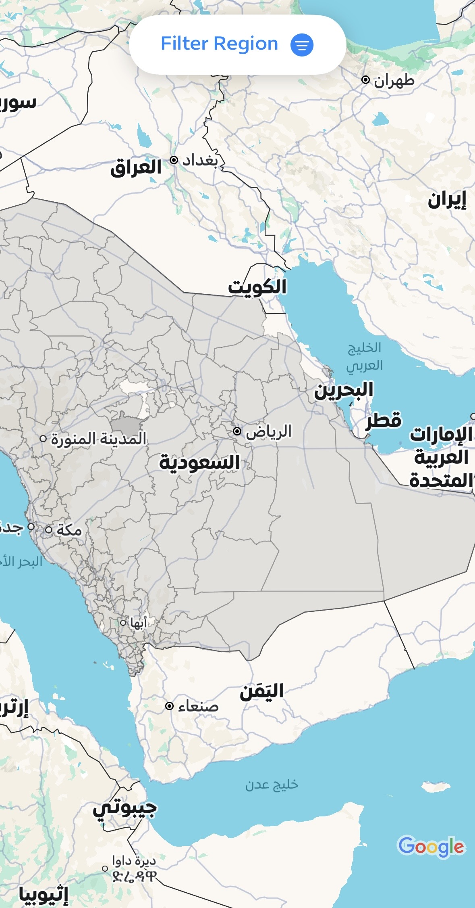
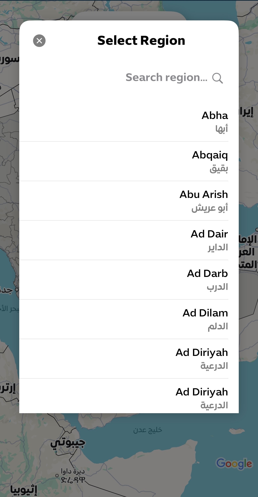
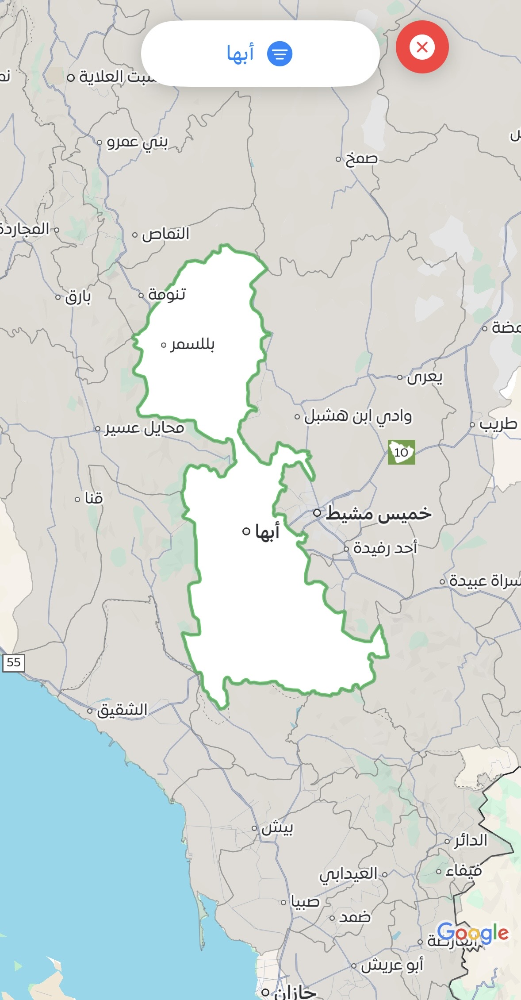
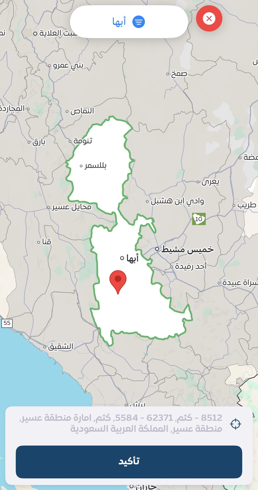

# RegionMapFilter

A powerful and customizable iOS library for filtering and managing regions using Google Maps SDK. RegionMapFilter provides an intuitive interface for region selection with polygon overlay support, making it perfect for delivery apps, service area management, and location-based filtering.

## Features

✅ **Interactive Map Interface** - Beautiful Google Maps integration with custom region overlays  
✅ **Multi-Region Selection** - Support for selecting multiple regions simultaneously  
✅ **GeoJSON Support** - Built-in support for GeoJSON files (includes Saudi Arabia ADM2 regions)  
✅ **Custom Filtering** - Powerful region filtering and search capabilities  
✅ **MVVM Architecture** - Clean, maintainable code structure  
✅ **Arabic/English Support** - RTL/LTR language direction handling  
✅ **Customizable UI** - Easily customize colors, styles, and behaviors  

## Screenshots

<p align="center">
  
  
  
  
</p>

### Key Features

| Interactive Map | Region Selection | Smart Filtering | Multi-Selection Support |
|:---------------:|:----------------:|:---------------:|:-----------------------:|
|  |  |  |  |
| View and interact with regions on Google Maps | Easy region selection with visual feedback | Filter and search through available regions | Select multiple regions simultaneously |

## Requirements

- iOS 13.0+
- Xcode 12.0+
- Swift 5.5+
- Google Maps SDK 8.0+

## Installation

### CocoaPods

[CocoaPods](https://cocoapods.org) is a dependency manager for Cocoa projects. For usage and installation instructions, visit their website. To integrate RegionMapFilter into your Xcode project using CocoaPods, specify it in your `Podfile`:

```ruby
pod 'RegionMapFilter', '~> 1.0.2'
```

Then run:

```bash
pod install
```

### Swift Package Manager

You can also use Swift Package Manager to add RegionMapFilter to your project:

1. In Xcode, select `File > Add Packages...`
2. Enter the repository URL: `https://github.com/Ahmedramadaan333/RegionMapFilter.git`
3. Select the version you want to use

Or add it to your `Package.swift` file:

```swift
dependencies: [
    .package(url: "https://github.com/Ahmedramadaan333/RegionMapFilter.git", from: "1.0.2")
]
```

## Setup

### 1. Google Maps API Key

RegionMapFilter uses Google Maps SDK, so you need to set up a Google Maps API key:

1. Get your API key from [Google Cloud Console](https://console.cloud.google.com/)
2. Add it to your `AppDelegate.swift`:

```swift
import GoogleMaps
import RegionMapFilter

@main
class AppDelegate: UIResponder, UIApplicationDelegate {
    func application(_ application: UIApplication, 
                    didFinishLaunchingWithOptions launchOptions: [UIApplication.LaunchOptionsKey: Any]?) -> Bool {
        GMSServices.provideAPIKey("YOUR_GOOGLE_MAPS_API_KEY")
        return true
    }
}
```

3. Add required permissions to your `Info.plist`:

```xml
<key>NSLocationWhenInUseUsageDescription</key>
<string>We need your location to show nearby regions</string>
<key>NSLocationAlwaysAndWhenInUseUsageDescription</key>
<string>We need your location to show nearby regions</string>
```

## Usage

### Basic Implementation

```swift
import UIKit
import RegionMapFilter

class ViewController: UIViewController {
    
    override func viewDidLoad() {
        super.viewDidLoad()
        showRegionFilter()
    }
    
    func showRegionFilter() {
        // Configure the region filter
        let config = RegionMapConfiguration(
            initialZoom: 6.0,
            selectedColor: .systemBlue,
            unselectedColor: .systemGray,
            strokeWidth: 2.0
        )
        
        // Create the view controller
        let regionVC = RegionMapViewController(configuration: config)
        
        // Handle region selection
        regionVC.onRegionsSelected = { [weak self] selectedRegions in
            print("Selected regions: \(selectedRegions)")
            // Handle selected regions
        }
        
        // Present the view controller
        navigationController?.pushViewController(regionVC, animated: true)
    }
}
```

### Advanced Configuration

```swift
// Create custom configuration
let config = RegionMapConfiguration(
    initialZoom: 7.0,
    selectedColor: UIColor(red: 0.2, green: 0.6, blue: 1.0, alpha: 0.4),
    unselectedColor: UIColor.gray.withAlphaComponent(0.2),
    strokeWidth: 3.0,
    strokeColor: .darkGray,
    enableSearch: true,
    allowMultipleSelection: true
)

let regionVC = RegionMapViewController(configuration: config)
regionVC.title = "Select Service Areas"

// Handle selection
regionVC.onRegionsSelected = { selectedRegions in
    let regionNames = selectedRegions.map { $0.name }.joined(separator: ", ")
    print("Selected: \(regionNames)")
}

navigationController?.pushViewController(regionVC, animated: true)
```

### Loading Custom GeoJSON Data

```swift
// Load your own GeoJSON data
let regionVC = RegionMapViewController(configuration: config)

// Load from bundle
if let geoJSONPath = Bundle.main.path(forResource: "your_regions", ofType: "geojson") {
    regionVC.loadGeoJSON(from: geoJSONPath)
}

// Or load from URL
let url = URL(string: "https://example.com/regions.geojson")!
regionVC.loadGeoJSON(from: url) { result in
    switch result {
    case .success:
        print("GeoJSON loaded successfully")
    case .failure(let error):
        print("Error loading GeoJSON: \(error)")
    }
}
```

### Programmatic Region Selection

```swift
let regionVC = RegionMapViewController(configuration: config)

// Select regions by ID
regionVC.selectRegions(withIDs: [101, 102, 103])

// Get currently selected regions
let selectedRegions = regionVC.getSelectedRegions()
print("Currently selected: \(selectedRegions.count) regions")

// Clear selection
regionVC.clearSelection()
```

### Using the Popup Selection View

```swift
// Create popup with regions
let regions: [RegionModel] = [
    RegionModel(id: 1, name: "Riyadh", coordinates: [...]),
    RegionModel(id: 2, name: "Jeddah", coordinates: [...]),
    RegionModel(id: 3, name: "Dammam", coordinates: [...])
]

let popupVC = RegionSelectionPopupViewController(
    regions: regions,
    allowMultipleSelection: true
)

popupVC.onRegionsSelected = { selectedRegions in
    print("Selected from popup: \(selectedRegions)")
}

present(popupVC, animated: true)
```

## Customization

### Custom Cell Design

```swift
// Register your custom cell
class CustomRegionCell: RegionCell {
    override func configure(with region: RegionModel) {
        super.configure(with: region)
        // Add your custom styling
        textLabel?.font = UIFont.boldSystemFont(ofSize: 16)
        textLabel?.textColor = .darkBlue
    }
}

// Use in your view controller
regionVC.registerCustomCell(CustomRegionCell.self)
```

### Custom Map Styling

```swift
let config = RegionMapConfiguration(
    initialZoom: 6.0,
    selectedColor: .systemGreen,
    unselectedColor: .systemGray.withAlphaComponent(0.3),
    strokeWidth: 2.5,
    strokeColor: .darkGray,
    mapStyle: .standard // or .satellite, .hybrid
)
```

### Handling User Location

```swift
let regionVC = RegionMapViewController(configuration: config)

// Enable user location
regionVC.showUserLocation = true

// Center on user location
regionVC.centerOnUserLocation { location in
    print("User is at: \(location.coordinate)")
}
```

## API Reference

### RegionMapConfiguration

Configuration object for customizing the map appearance and behavior.

| Property | Type | Default | Description |
|----------|------|---------|-------------|
| `initialZoom` | `Float` | `6.0` | Initial map zoom level |
| `selectedColor` | `UIColor` | `.systemBlue` | Color for selected regions |
| `unselectedColor` | `UIColor` | `.systemGray` | Color for unselected regions |
| `strokeWidth` | `CGFloat` | `2.0` | Width of region borders |
| `strokeColor` | `UIColor` | `.darkGray` | Color of region borders |
| `enableSearch` | `Bool` | `true` | Enable search functionality |
| `allowMultipleSelection` | `Bool` | `false` | Allow multiple region selection |

### RegionModel

Model representing a geographic region.

```swift
struct RegionModel {
    let id: Int
    let name: String
    let coordinates: [[CLLocationCoordinate2D]]
    var isSelected: Bool
    var metadata: [String: Any]?
}
```

### RegionMapViewController

Main view controller for displaying and managing regions.

#### Methods

```swift
// Load GeoJSON data
func loadGeoJSON(from path: String)
func loadGeoJSON(from url: URL, completion: ((Result<Void, Error>) -> Void)?)

// Region selection
func selectRegions(withIDs ids: [Int])
func getSelectedRegions() -> [RegionModel]
func clearSelection()

// Map interaction
func centerOnUserLocation(completion: ((CLLocation) -> Void)?)
func zoomToRegion(withID id: Int, animated: Bool)
func fitAllRegions(animated: Bool)
```

#### Callbacks

```swift
// Called when regions are selected
var onRegionsSelected: (([RegionModel]) -> Void)?

// Called when a region is tapped
var onRegionTapped: ((RegionModel) -> Void)?

// Called when map is moved
var onMapMoved: ((GMSCameraPosition) -> Void)?
```

## Included GeoJSON Data

RegionMapFilter comes with Saudi Arabia administrative level 2 (ADM2) regions GeoJSON data:

- **File**: `SAU_ADM2_2021.geojson`
- **Regions**: 147+ governorates
- **Coverage**: All Saudi Arabia administrative regions

### Accessing Built-in GeoJSON

```swift
// The GeoJSON is automatically available in the resource bundle
let regionVC = RegionMapViewController(configuration: config)
regionVC.loadDefaultSaudiRegions() // Loads SAU_ADM2_2021.geojson
```

## Example Project

Check out the example project in the repository for a complete implementation:

```bash
git clone https://github.com/Ahmedramadaan333/RegionMapFilter.git
cd RegionMapFilter/Example
pod install
open RegionMapFilter.xcworkspace
```

## Architecture

RegionMapFilter follows the MVVM (Model-View-ViewModel) architecture pattern:

```
RegionMapFilter/
├── Model/
│   └── RegionModel.swift           # Data models
├── View/
│   ├── RegionMapViewController.swift      # Main map view
│   ├── RegionSelectionPopupViewController.swift  # Selection popup
│   └── RegionCell.swift                  # Table view cell
├── ViewModel/
│   └── RegionMapViewModel.swift          # Business logic
├── Configuration/
│   └── RegionMapConfiguration.swift      # Configuration
└──── GeojsonFile/
        └── SAU_ADM2_2021.geojson        # Saudi regions data
```

## Best Practices

### Memory Management

Always use `[weak self]` in closures to prevent retain cycles:

```swift
regionVC.onRegionsSelected = { [weak self] selectedRegions in
    self?.handleRegionSelection(selectedRegions)
}
```

### Performance Tips

1. **Limit visible regions**: For large datasets, implement region clustering
2. **Use appropriate zoom levels**: Don't load all regions at once
3. **Cache selections**: Store previously selected regions for better UX

```swift
// Cache selected region IDs
UserDefaults.standard.set(selectedRegionIDs, forKey: "cached_regions")

// Restore on next launch
if let cachedIDs = UserDefaults.standard.array(forKey: "cached_regions") as? [Int] {
    regionVC.selectRegions(withIDs: cachedIDs)
}
```

## Troubleshooting

### Google Maps not showing

**Problem**: Map appears as gray box

**Solution**: Ensure you've added your Google Maps API key:

```swift
GMSServices.provideAPIKey("YOUR_API_KEY")
```

### GeoJSON not loading

**Problem**: Regions don't appear on map

**Solution**: Check the GeoJSON file path and format:

```swift
// Debug GeoJSON loading
if let path = Bundle.main.path(forResource: "regions", ofType: "geojson") {
    print("GeoJSON path: \(path)")
    do {
        let data = try Data(contentsOf: URL(fileURLWithPath: path))
        print("GeoJSON size: \(data.count) bytes")
    } catch {
        print("Error reading GeoJSON: \(error)")
    }
}
```

### Memory issues with large GeoJSON

**Problem**: App crashes with large region files

**Solution**: Implement pagination or region clustering:

```swift
// Load regions in batches
regionVC.loadRegionsBatch(from: 0, to: 50)
```

## Contributing

Contributions are welcome! Please feel free to submit a Pull Request.

1. Fork the repository
2. Create your feature branch (`git checkout -b feature/AmazingFeature`)
3. Commit your changes (`git commit -m 'Add some AmazingFeature'`)
4. Push to the branch (`git push origin feature/AmazingFeature`)
5. Open a Pull Request

### Development Setup

```bash
# Clone the repository
git clone https://github.com/Ahmedramadaan333/RegionMapFilter.git
cd RegionMapFilter

# Install dependencies
pod install

# Open in Xcode
open RegionMapFilter.xcworkspace
```

## Changelog

### Version 1.0.2 (Latest)
- ✅ Added GeoJSON resource bundle support
- ✅ Included Saudi Arabia ADM2 regions data
- ✅ Improved resource file handling

### Version 1.0.1
- ✅ Enhanced region selection UI
- ✅ Fixed memory management issues
- ✅ Improved documentation

### Version 1.0.0
- 🎉 Initial release
- ✅ Google Maps integration
- ✅ Region filtering and selection
- ✅ MVVM architecture
- ✅ Arabic/English support

## License

RegionMapFilter is available under the MIT license. See the [LICENSE](LICENSE) file for more info.

```
MIT License

Copyright (c) 2024 Ahmed Ramadan

Permission is hereby granted, free of charge, to any person obtaining a copy
of this software and associated documentation files (the "Software"), to deal
in the Software without restriction, including without limitation the rights
to use, copy, modify, merge, publish, distribute, sublicense, and/or sell
copies of the Software, and to permit persons to whom the Software is
furnished to do so, subject to the following conditions:

The above copyright notice and this permission notice shall be included in all
copies or substantial portions of the Software.

THE SOFTWARE IS PROVIDED "AS IS", WITHOUT WARRANTY OF ANY KIND, EXPRESS OR
IMPLIED, INCLUDING BUT NOT LIMITED TO THE WARRANTIES OF MERCHANTABILITY,
FITNESS FOR A PARTICULAR PURPOSE AND NONINFRINGEMENT. IN NO EVENT SHALL THE
AUTHORS OR COPYRIGHT HOLDERS BE LIABLE FOR ANY CLAIM, DAMAGES OR OTHER
LIABILITY, WHETHER IN AN ACTION OF CONTRACT, TORT OR OTHERWISE, ARISING FROM,
OUT OF OR IN CONNECTION WITH THE SOFTWARE OR THE USE OR OTHER DEALINGS IN THE
SOFTWARE.
```

## Author

**Ahmed Ramadan**  
📧 Email: 12ramadan.ail@gmail.com  
🐙 GitHub: [@Ahmedramadaan333](https://github.com/Ahmedramadaan333)

## Acknowledgments

- Google Maps SDK for iOS
- All contributors and users of RegionMapFilter
- Saudi Arabia GeoJSON data from [source]

## Support

If you find RegionMapFilter useful, please consider:

- ⭐️ Starring the repository
- 🐛 Reporting bugs
- 💡 Suggesting new features
- 📖 Improving documentation

For questions and support, please open an issue on [GitHub](https://github.com/Ahmedramadaan333/RegionMapFilter/issues).

---

Made with ❤️ by Ahmed Ramadan
